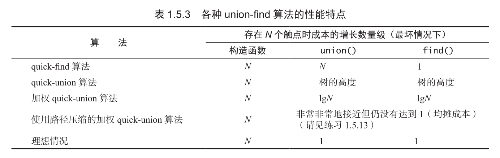

[toc]

# Note

## UF

### quick-find

 `p` and `q` is connected when `id[q] == id[p]`

so when we union `pID` and `qID`, we must iterate list to made `id[i] = qID` when `id[i] = pID` 

```java
void union(int p, int q) {
    int pID = find(p);
    int qID = find(q);
    if (pID == qID) return;
    for (int i = 0; i < id.length; i++) {
        if (id[i] == pID)
            id[i] = qID;
    }
    count -= 1;
}

int find(int p) {
    return id[p];
}
```

cost analyze：

`find` only visit list once

`union` must scan all number of list to modify value, visit time between `N+3` at `2N+1` , include change value operate

if we use quick find to solve problem and get one 连通分量，this algorithm time complexity is $O(n^2)$，the cost is too expense to process large dataset.

这种方式定义的数据结构很清晰，如果`id[i]`和`id[j]`属于同一个连通分量，那么`id[i]`和`id[j]`的`value`相同，如果画图表示，相当于聚类的形状。由于表示很简单，查找也非常快速，只需要一次访问就能查到`id[i]`对应的连通分量，但是如果要合并两个连通分量的话，必须要完全修改其中一个连通分量。相当于两个聚类合并。

这个算法不适用于那些最终会得到较少连通分量的数据集，这意味着需要合并连通分量的操作较多，该算法的时间复杂度会到$O(n^2)$

### quick-union

现在改变定义方式，让连通分量中每个点都指向同一个连通分量的其它点，指向自己的结点是这个连通分量的根节点。无论从哪个点开始，最终都可以通过不断访问达到根节点。因为一个连通分量只有一个根节点，所以我们可以用根节点的ID来表示一个连通分量。

当我们要合并两个连通分量的时候，只需要修改其中一个根节点的值指向另一个节点即可。如果我们要判断两个节点是否属于同一个连通分量，只需要判断它们所在的连通分量根节点是否相同即可。

```java
void union(int p, int q) {
    int pRoot = find(p);
    int qRoot = find(q);
    if (pRoot == qRoot)
        return;
    id[pRoot] = qRoot;
    count--;
}

int find(int p) {
    while (p != id[p]) p = id[p];
    return p;
}
```

cost analyze:

`quick-union`的开销和输入实例有关，大致可以认为$\Omega(n)$，$O(n^2)$

并不需要知道`quick-union`的具体开销，因为我们会学到更优的算法。就目前来看`quick-union`可以看作`quick-find`的优化，因为它将`union`的速度优化到了线性级别

补充：

同时这也是我学到的最初始的并查集写法，不带压缩的版本

### weighted quick-union

当需要合并的时候，将较小的一棵树连接到较大的一棵树上

```java
void union(int p, int q) {
    int i = find(p);
    int j = find(q);
    if (i == j) return;
    if (sz[i] < sz[j]) {
        id[i] = j;
        sz[j] += sz[i];
    } else {
        id[j] = i;
        sz[i] += sz[j];
    }
    count -= 1;
}


int find(int p) {
    while (p != id[p]) p = id[p];
    return p;
}
```



注意加权`quick-union`需要额外的空间来存放`sz`

还有另一种方法叫做压缩路径，但是实际上并没有优于加权`quick-union`

路径压缩的加权`quick-union`算法是最优的算法，但是并非所有操作都能在常数时间内完成

使用路径压缩的加权 quick-union 算法已经是我们对于这个问题能够给出的最优解了